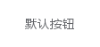
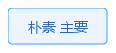
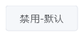

# Button 按钮

常用的操作按钮。

## 基本用法

基础的按钮用法。



```java
import org.swelement.ui.AstButton;
import org.swelement.ui.Button;

// 默认按钮
AstButton defaultBtn = new AstButton("默认按钮");

        // 主要按钮
        AstButton primaryBtn = new AstButton("主要按钮", AstButton.PRIMARY, false);

        // 成功按钮
        AstButton successBtn = new AstButton("成功按钮", AstButton.SUCCESS, false);

        // 警告按钮
        AstButton warningBtn = new AstButton("警告按钮", AstButton.WARNING, false);

        // 危险按钮
        AstButton dangerBtn = new AstButton("危险按钮", AstButton.DANGER, false);

        // 信息按钮
        AstButton infoBtn = new AstButton("信息按钮", AstButton.INFO, false);
```

## 朴素按钮

朴素风格的按钮。



```java
// 朴素主要按钮
Button plainPrimary = new Button("朴素 主要", Button.PRIMARY, true);

// 朴素成功按钮
Button plainSuccess = new Button("朴素 成功", Button.SUCCESS, true);

// 朴素警告按钮
Button plainWarning = new Button("朴素 警告", Button.WARNING, true);

// 朴素危险按钮
Button plainDanger = new Button("朴素 危险", Button.DANGER, true);

// 朴素信息按钮
Button plainInfo = new Button("朴素 信息", Button.INFO, true);
```

## 禁用状态

禁用状态的按钮。



```java
// 禁用主要按钮
Button disabledPrimary = new Button("禁用-主要", Button.PRIMARY, false);
disabledPrimary.setEnabled(false);

// 禁用朴素按钮
Button disabledPlain = new Button("禁用-朴素", Button.PRIMARY, true);
disabledPlain.setEnabled(false);

// 禁用默认按钮
Button disabledDefault = new Button("禁用-默认", Button.DEFAULT, false);
disabledDefault.setEnabled(false);
```

## Button 属性

| 参数 | 说明 | 类型 | 可选值 | 默认值 |
|------|------|------|--------|--------|
| text | 按钮文字 | String | — | — |
| type | 按钮类型 | int | DEFAULT / PRIMARY / SUCCESS / WARNING / DANGER / INFO | DEFAULT |
| plain | 是否朴素按钮 | boolean | — | false |
