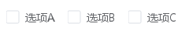

# Checkbox 多选框

一组备选项中进行多选。

## 基本用法

基础的多选框用法。



```java
import org.swelement.ui.AstCheckbox;
import org.swelement.ui.Checkbox;

// 创建多选框
AstCheckbox checkbox1 = new AstCheckbox("选项A");
        AstCheckbox checkbox2 = new AstCheckbox("选项B");
        AstCheckbox checkbox3 = new AstCheckbox("选项C");
```

## 禁用状态

禁用状态的多选框。


```java
// 禁用多选框
Checkbox disabledCheckbox = new Checkbox("禁用选项");
disabledCheckbox.setEnabled(false);
```

## Checkbox 属性

| 参数 | 说明 | 类型 | 可选值 | 默认值 |
|------|------|------|--------|--------|
| text | 多选框文字 | String | — | — |
