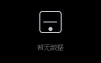
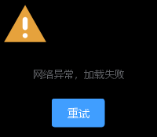

# Empty 空状态

用于数据为空、无权限、加载失败等场景的占位展示，通常配合一个操作按钮引导用户下一步。

## 基本用法

最简单的空状态只需一段描述文字，使用内置默认插图。



```java
import org.swelement.ui.AstEmpty;

AstEmpty empty = new AstEmpty("暂无数据");
```

## 自定义插图

可以指定一个 `AstIcon` 类型作为插图，或传入任意 `Icon` 作为自定义插图。


```java
import org.swelement.ui.AstEmpty;
import org.swelement.ui.AstIcon;

AstEmpty empty = new AstEmpty("没有找到相关内容");
empty.setIconType(AstIcon.SEARCH);
empty.setIconSize(72);
```

## 带操作按钮

通过 `setAction` 在空状态下方放置一个操作按钮（或任意组件），引导用户刷新、返回等。



```java
import org.swelement.ui.AstEmpty;
import org.swelement.ui.AstIcon;
import org.swelement.ui.AstButton;

AstEmpty empty = new AstEmpty("网络异常，加载失败");
empty.setIconType(AstIcon.WARNING);
empty.setAction(new AstButton("重试", AstButton.PRIMARY, false));
```

## Empty 属性

| 参数 | 说明 | 类型 | 可选值 | 默认值 |
|------|------|------|--------|--------|
| description | 描述文字 | String | — | "暂无数据" |
| image | 自定义插图（优先级最高） | Icon | — | null |
| iconType | 用 AstIcon 类型作为插图 | int | AstIcon.* | -1 |
| iconSize | 插图尺寸 | int | [24, 160] | 64 |
| action | 操作区组件 | JComponent | — | null |

## Empty 方法

| 方法名 | 说明 | 参数 | 返回值 |
|--------|------|------|--------|
| setDescription | 设置描述文字 | String d | void |
| setImage | 设置自定义插图 | Icon img | void |
| setIconType | 设置 AstIcon 类型插图 | int astIconType | void |
| setIconSize | 设置插图尺寸 | int s | void |
| setAction | 设置操作区组件（传 null 移除） | JComponent a | void |
