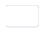
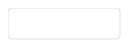
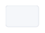

# Input 输入框

输入框组件，支持占位符和可清空功能。

## 基本用法

基础的输入框用法。



```java
import org.swelement.ui.AstInput;

// 带占位符的输入框
AstInput input = new AstInput("请输入内容");
```

## 可清空

输入框右侧显示清空按钮。



```java
import org.swelement.ui.AstInput;

// 输入内容后，鼠标悬停显示清空按钮
AstInput clearableInput = new AstInput("请输入内容");
```

## 禁用状态

禁用状态的输入框。



```java
import org.swelement.ui.AstInput;

// 禁用输入框
AstInput disabledInput = new AstInput("请输入内容");
disabledInput.setEnabled(false);
```

## Input 属性

| 参数 | 说明 | 类型 | 可选值 | 默认值 |
|------|------|------|--------|--------|
| placeholder | 占位符文本 | String | — | — |

## Input 方法

| 方法名 | 说明 | 参数 | 返回值 |
|--------|------|------|--------|
| getText | 获取输入框文本 | — | String |
| setText | 设置输入框文本 | String t | void |
