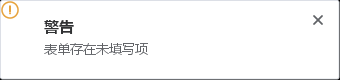

# Notification 通知

出现在页面四角的轻量通知，用于异步操作结果的反馈。不阻断后台操作，默认 4.5 秒后自动关闭，也可手动关闭。

## 基本用法

默认出现在右上角，包含类型图标、标题与描述。


```java
import org.swelement.ui.AstNotification;
import javax.swing.JFrame;

JFrame frame = new JFrame();
AstNotification.show(frame, AstNotification.NotificationType.SUCCESS, "成功", "数据已保存");
```

## 不同位置

通过 `Position` 指定出现在四个角之一：TOP_RIGHT（默认）、TOP_LEFT、BOTTOM_RIGHT、BOTTOM_LEFT。同位置多条通知会自动向下/向上堆叠。



```java
import org.swelement.ui.AstNotification;
import javax.swing.JFrame;

JFrame frame = new JFrame();
AstNotification.show(frame, AstNotification.NotificationType.WARNING, "警告", "表单存在未填写项", 0, AstNotification.Position.BOTTOM_LEFT, null);
AstNotification.show(frame, AstNotification.NotificationType.INFO, "提示", "这是一条较长的通知内容", 6000, AstNotification.Position.BOTTOM_RIGHT, null);
```

## 类型

| 类型 | 说明 | 左侧图标 |
|------|------|----------|
| SUCCESS | 成功 | 绿色对勾圆点 |
| WARNING | 警告 | 黄色叹号圆点 |
| INFO | 信息 | 蓝色信息圆点 |
| ERROR | 错误 | 红色叉号圆点 |

## Notification 方法

| 方法名 | 说明 | 参数 | 返回值 |
|--------|------|------|--------|
| show(owner, type, title, message) | 右上角显示通知（默认 4.5s 自动关闭） | Window, NotificationType, String, String | void |
| show(owner, type, title, message, durationMs) | 指定自动关闭时长（毫秒，≤0 用默认） | + int | void |
| show(owner, type, title, message, durationMs, pos) | 指定位置 | + Position | void |
| show(owner, type, title, message, durationMs, pos, onClose) | 关闭（自动或手动）后回调 | + Runnable | void |
